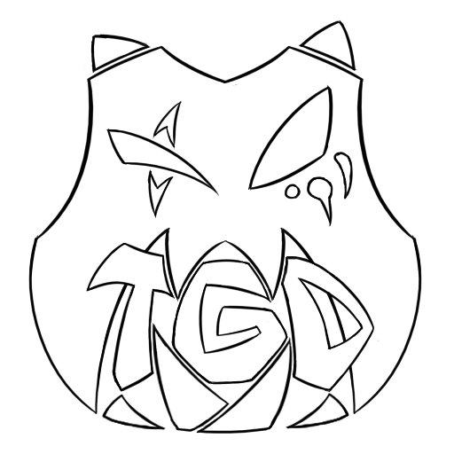

# Logotypes de [*TeleGame Design*](https://telegd.github.io/)

## Version complète

### Multicolore

### Bicolore

### Incolore

## Sigle uniquement

### Multicolore

### Bicolore

### Unicolore

### Incolore

